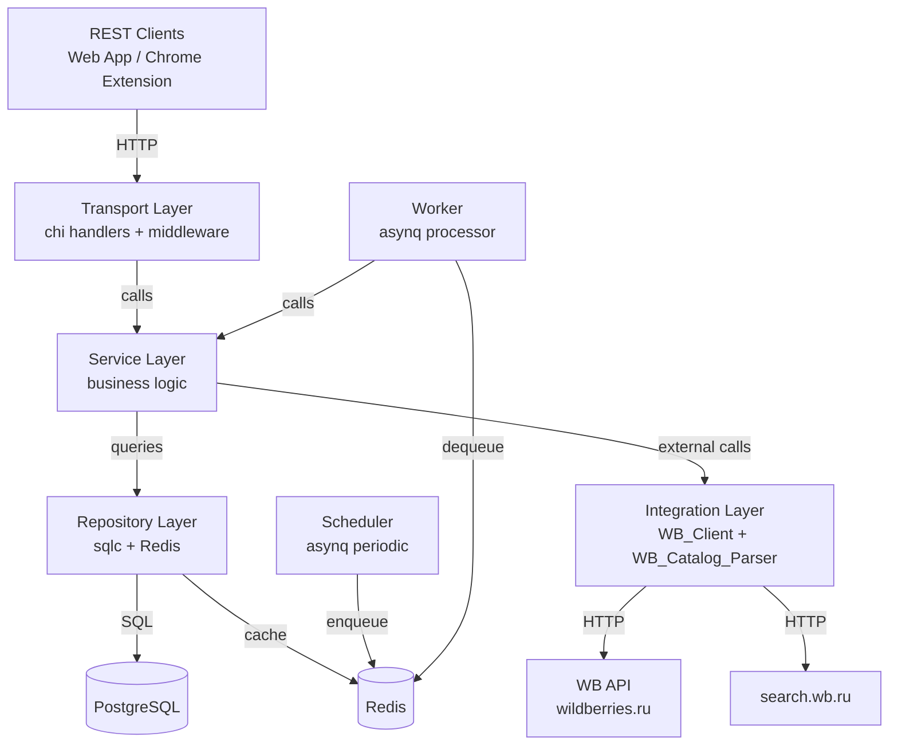
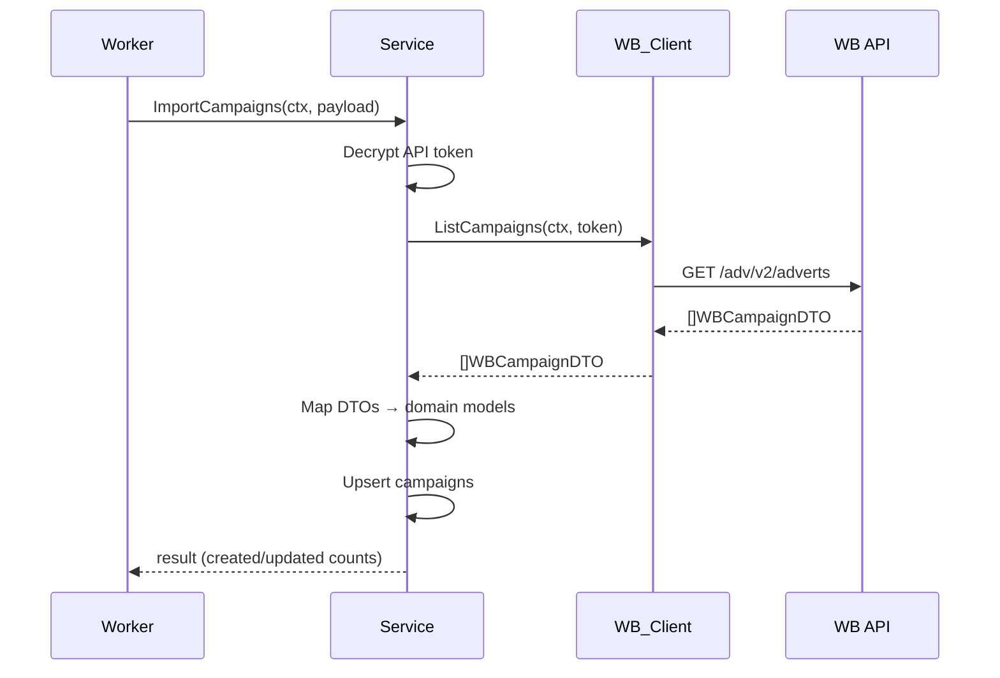
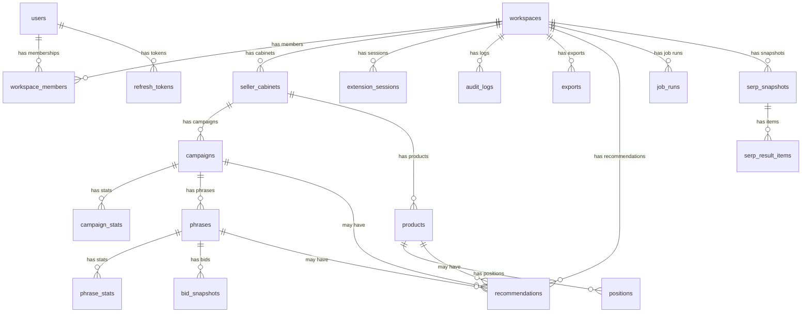

# Технический дизайн: Sellico Ads Intelligence Backend

## Обзор

Sellico Ads Intelligence Backend — production-grade backend-система на Go 1.24+ для аналитики и мониторинга рекламы Wildberries. Система реализует multi-tenant REST API, фоновые задачи (workers/schedulers), интеграцию с WB API и парсинг публичного каталога search.wb.ru.

Ключевые архитектурные решения:
- **Clean modular architecture** — разделение на слои (transport → service → repository) без переусложнения
- **Multi-tenancy** — изоляция данных через workspace_id на уровне БД и middleware
- **Dual data sources** — официальный WB API + парсинг search.wb.ru (WB_Catalog_Parser)
- **Async processing** — asynq (Redis) для фоновых задач с retry и scheduling
- **Type-safe SQL** — sqlc для генерации Go-кода из SQL-запросов

Система состоит из двух процессов:
1. **API Server** — HTTP-сервер (chi router), обрабатывает REST-запросы
2. **Worker** — фоновый процесс (asynq), обрабатывает задачи из очередей и запускает scheduler

## Архитектура

### Архитектурные слои

```
┌─────────────────────────────────────────────────────┐
│                   Transport Layer                    │
│  chi router, middleware (auth, RBAC, tenant, log)   │
│  HTTP handlers, request/response DTOs, validation   │
├─────────────────────────────────────────────────────┤
│                   Service Layer                      │
│  Business logic, orchestration, recommendation      │
│  engine, export generation                          │
├─────────────────────────────────────────────────────┤
│                  Repository Layer                    │
│  sqlc-generated queries, PostgreSQL access           │
│  Redis cache operations                             │
├─────────────────────────────────────────────────────┤
│                 Integration Layer                    │
│  WB_Client (WB API), WB_Catalog_Parser (search.wb)  │
│  DTOs, mappers, retry, rate-limiting                │
├─────────────────────────────────────────────────────┤
│                Infrastructure Layer                  │
│  Config, crypto (AES-256-GCM, argon2id), logging    │
│  migrations, health checks, OpenTelemetry           │
└─────────────────────────────────────────────────────┘
```

### Взаимодействие слоёв



**Правила зависимостей:**
- Transport → Service (никогда напрямую в Repository или Integration)
- Service → Repository + Integration (бизнес-логика координирует доступ к данным и внешним API)
- Repository → PostgreSQL / Redis (только data access)
- Integration → External HTTP APIs (изолированные клиенты)
- Infrastructure используется всеми слоями (config, crypto, logging)

### Процессы

| Процесс | Точка входа | Описание |
|---------|------------|----------|
| API Server | `cmd/api/main.go` | HTTP-сервер, обрабатывает REST-запросы |
| Worker | `cmd/worker/main.go` | asynq processor + scheduler, фоновые задачи |

Оба процесса разделяют общий код (service, repository, integration, infrastructure), но имеют разные точки входа и конфигурации.

## Компоненты и интерфейсы

### Структура проекта

```
sellico-ads-intelligence-backend/
├── cmd/
│   ├── api/
│   │   └── main.go                  # API Server entrypoint
│   └── worker/
│       └── main.go                  # Worker + Scheduler entrypoint
├── internal/
│   ├── config/
│   │   └── config.go                # Typed config from env vars
│   ├── transport/
│   │   ├── middleware/
│   │   │   ├── auth.go              # JWT authentication
│   │   │   ├── rbac.go              # Role-based access control
│   │   │   ├── tenant.go            # Workspace isolation (tenant scope)
│   │   │   ├── logging.go           # Request logging (zerolog)
│   │   │   ├── recovery.go          # Panic recovery
│   │   │   └── requestid.go         # Request ID injection
│   │   ├── handler/
│   │   │   ├── auth.go              # POST /auth/register, /auth/login, etc.
│   │   │   ├── workspace.go         # CRUD workspaces, members
│   │   │   ├── seller_cabinet.go    # CRUD seller cabinets
│   │   │   ├── campaign.go          # List/get campaigns, stats
│   │   │   ├── phrase.go            # List/get phrases, stats, bids
│   │   │   ├── product.go           # List/get products
│   │   │   ├── position.go          # Position history, aggregates
│   │   │   ├── serp.go              # SERP snapshots
│   │   │   ├── bid.go               # Bid history
│   │   │   ├── recommendation.go    # Recommendations CRUD
│   │   │   ├── export.go            # Export requests, status, download
│   │   │   ├── extension.go         # Chrome extension endpoints
│   │   │   ├── audit.go             # Audit log
│   │   │   └── health.go            # Health checks
│   │   ├── dto/
│   │   │   ├── request.go           # Request DTOs + validation
│   │   │   └── response.go          # Response DTOs + envelope
│   │   └── router.go                # chi router setup
│   ├── service/
│   │   ├── auth.go                  # Auth business logic
│   │   ├── workspace.go             # Workspace + members logic
│   │   ├── seller_cabinet.go        # Seller cabinet logic + token encryption
│   │   ├── campaign.go              # Campaign logic
│   │   ├── phrase.go                # Phrase/Search Cluster logic
│   │   ├── product.go               # Product logic
│   │   ├── position.go              # Position logic
│   │   ├── serp.go                  # SERP logic
│   │   ├── bid.go                   # Bid logic
│   │   ├── recommendation.go        # Recommendation engine v1
│   │   ├── export.go                # Export generation (CSV/XLSX)
│   │   ├── extension.go             # Extension session + context
│   │   └── audit.go                 # Audit log logic
│   ├── repository/
│   │   ├── sqlc/                    # sqlc generated code
│   │   │   ├── db.go
│   │   │   ├── models.go
│   │   │   ├── querier.go
│   │   │   └── *.sql.go             # Generated query implementations
│   │   ├── queries/                 # SQL query files for sqlc
│   │   │   ├── users.sql
│   │   │   ├── workspaces.sql
│   │   │   ├── seller_cabinets.sql
│   │   │   ├── campaigns.sql
│   │   │   ├── campaign_stats.sql
│   │   │   ├── phrases.sql
│   │   │   ├── phrase_stats.sql
│   │   │   ├── products.sql
│   │   │   ├── positions.sql
│   │   │   ├── serp_snapshots.sql
│   │   │   ├── bid_snapshots.sql
│   │   │   ├── recommendations.sql
│   │   │   ├── exports.sql
│   │   │   ├── extension_sessions.sql
│   │   │   ├── audit_logs.sql
│   │   │   ├── job_runs.sql
│   │   │   └── refresh_tokens.sql
│   │   └── cache/
│   │       └── redis.go             # Redis cache operations
│   ├── integration/
│   │   ├── wb/
│   │   │   ├── client.go            # WB API HTTP client (retry, rate-limit)
│   │   │   ├── campaigns.go         # Campaign API methods
│   │   │   ├── statistics.go        # Statistics API methods
│   │   │   ├── search_clusters.go   # Search Cluster API methods
│   │   │   ├── bids.go              # Recommended Bids API methods
│   │   │   ├── products.go          # Product Cards API methods
│   │   │   ├── analytics.go         # Sales Funnel, Seller Analytics
│   │   │   ├── config_api.go        # Configuration API (categories, cpm_min)
│   │   │   ├── dto.go               # WB API request/response DTOs
│   │   │   └── mapper.go            # WB DTO → domain model mappers
│   │   └── catalog/
│   │       ├── parser.go            # WB_Catalog_Parser (search.wb.ru)
│   │       ├── proxy.go             # Proxy rotation
│   │       └── dto.go               # Parser DTOs
│   ├── worker/
│   │   ├── handler/
│   │   │   ├── import_campaigns.go
│   │   │   ├── import_campaign_stats.go
│   │   │   ├── import_sales_funnel.go
│   │   │   ├── import_phrases.go
│   │   │   ├── import_phrase_stats.go
│   │   │   ├── import_seller_analytics.go
│   │   │   ├── position_checks.go
│   │   │   ├── serp_scans.go
│   │   │   ├── bid_estimation.go
│   │   │   ├── recommendation_gen.go
│   │   │   ├── exports.go
│   │   │   └── extension_events.go
│   │   ├── scheduler.go             # Periodic task scheduling
│   │   └── registry.go              # Task handler registration
│   ├── domain/
│   │   └── model.go                 # Domain models (structs)
│   └── pkg/
│       ├── crypto/
│       │   ├── aes.go               # AES-256-GCM encrypt/decrypt
│       │   └── argon2.go            # argon2id hash/verify
│       ├── jwt/
│       │   └── jwt.go               # JWT generation/validation
│       ├── envelope/
│       │   └── envelope.go          # Response envelope helper
│       ├── pagination/
│       │   └── pagination.go        # Pagination params parsing
│       └── validate/
│           └── validate.go          # Input validation helpers
├── migrations/
│   ├── 000001_init.up.sql
│   ├── 000001_init.down.sql
│   └── ...
├── sqlc.yaml                        # sqlc configuration
├── docker-compose.yml
├── Dockerfile
├── Makefile
├── .env.example
└── go.mod
```

### Ключевые интерфейсы

Каждый слой определяет интерфейсы, которые реализуются конкретными имплементациями. Это обеспечивает тестируемость и заменяемость компонентов.

#### Service Layer Interfaces

```go
// AuthService — аутентификация и управление сессиями
type AuthService interface {
    Register(ctx context.Context, req RegisterRequest) (*AuthTokens, error)
    Login(ctx context.Context, req LoginRequest) (*AuthTokens, error)
    RefreshToken(ctx context.Context, refreshToken string) (*AuthTokens, error)
    Logout(ctx context.Context, refreshToken string) error
}

// WorkspaceService — управление workspace и участниками
type WorkspaceService interface {
    Create(ctx context.Context, userID uuid.UUID, req CreateWorkspaceRequest) (*Workspace, error)
    List(ctx context.Context, userID uuid.UUID, params PaginationParams) (*PaginatedResult[Workspace], error)
    InviteMember(ctx context.Context, workspaceID uuid.UUID, req InviteMemberRequest) error
    UpdateMemberRole(ctx context.Context, workspaceID, memberID uuid.UUID, role Role) error
    RemoveMember(ctx context.Context, workspaceID, memberID uuid.UUID) error
}

// CampaignService — кампании и статистика
type CampaignService interface {
    List(ctx context.Context, workspaceID uuid.UUID, params CampaignListParams) (*PaginatedResult[Campaign], error)
    Get(ctx context.Context, workspaceID, campaignID uuid.UUID) (*Campaign, error)
    GetStats(ctx context.Context, campaignID uuid.UUID, params DateRangeParams) (*PaginatedResult[CampaignStat], error)
}

// PhraseService — фразы (Search Clusters) и статистика
type PhraseService interface {
    ListByCampaign(ctx context.Context, campaignID uuid.UUID, params PhraseListParams) (*PaginatedResult[PhraseWithBid], error)
    GetStats(ctx context.Context, phraseID uuid.UUID, params DateRangeParams) (*PaginatedResult[PhraseStat], error)
}

// PositionService — позиции товаров
type PositionService interface {
    GetHistory(ctx context.Context, params PositionHistoryParams) (*PaginatedResult[Position], error)
    GetAggregated(ctx context.Context, params PositionAggregateParams) (*PositionAggregate, error)
}

// RecommendationService — рекомендации
type RecommendationService interface {
    List(ctx context.Context, workspaceID uuid.UUID, params RecommendationListParams) (*PaginatedResult[Recommendation], error)
    UpdateStatus(ctx context.Context, recID uuid.UUID, status RecommendationStatus) error
}
```

#### Integration Layer Interfaces

```go
// WBClient — клиент WB Advertising API
type WBClient interface {
    ListCampaigns(ctx context.Context, token string) ([]WBCampaignDTO, error)
    GetCampaignStats(ctx context.Context, token string, campaignIDs []int, dateFrom, dateTo string) ([]WBCampaignStatDTO, error)
    ListSearchClusters(ctx context.Context, token string, campaignID int) ([]WBSearchClusterDTO, error)
    GetSearchClusterStats(ctx context.Context, token string, campaignID int) ([]WBSearchClusterStatDTO, error)
    GetRecommendedBids(ctx context.Context, token string, campaignID int, articles []int) ([]WBBidDTO, error)
    GetCategoryConfig(ctx context.Context, token string) ([]WBCategoryConfigDTO, error)
    ListProducts(ctx context.Context, token string) ([]WBProductDTO, error)
    GetSalesFunnel(ctx context.Context, token string, params SalesFunnelParams) ([]WBSalesFunnelDTO, error)
}

// CatalogParser — парсер публичного каталога WB
type CatalogParser interface {
    SearchProducts(ctx context.Context, query string, region string) ([]CatalogProduct, error)
    FindProductPosition(ctx context.Context, query string, region string, productID int64) (int, error)
}
```

#### Repository Layer Interfaces

Repository layer использует sqlc-generated `Querier` interface. Дополнительно — Redis cache:

```go
// Cache — Redis cache operations
type Cache interface {
    Get(ctx context.Context, key string) ([]byte, error)
    Set(ctx context.Context, key string, value []byte, ttl time.Duration) error
    Delete(ctx context.Context, key string) error
    InvalidateByPrefix(ctx context.Context, prefix string) error
}
```

### HTTP API Endpoints

Все эндпоинты используют префикс `/api/v1`. Ответы в формате `Response_Envelope`.

#### Аутентификация (публичные)

| Метод | Путь | Описание |
|-------|------|----------|
| POST | `/api/v1/auth/register` | Регистрация пользователя |
| POST | `/api/v1/auth/login` | Вход в систему |
| POST | `/api/v1/auth/refresh` | Обновление access token |
| POST | `/api/v1/auth/logout` | Выход (инвалидация refresh token) |

#### Workspaces (требуют auth)

| Метод | Путь | Описание |
|-------|------|----------|
| POST | `/api/v1/workspaces` | Создать workspace |
| GET | `/api/v1/workspaces` | Список workspace пользователя |
| GET | `/api/v1/workspaces/{id}` | Получить workspace |
| POST | `/api/v1/workspaces/{id}/members` | Пригласить участника |
| PATCH | `/api/v1/workspaces/{id}/members/{memberId}` | Изменить роль |
| DELETE | `/api/v1/workspaces/{id}/members/{memberId}` | Удалить участника |

#### Seller Cabinets (требуют auth + workspace scope + owner/manager)

| Метод | Путь | Описание |
|-------|------|----------|
| POST | `/api/v1/seller-cabinets` | Добавить кабинет |
| GET | `/api/v1/seller-cabinets` | Список кабинетов workspace |
| GET | `/api/v1/seller-cabinets/{id}` | Получить кабинет |
| DELETE | `/api/v1/seller-cabinets/{id}` | Удалить кабинет (soft delete) |

#### Campaigns (требуют auth + workspace scope)

| Метод | Путь | Описание |
|-------|------|----------|
| GET | `/api/v1/campaigns` | Список кампаний workspace |
| GET | `/api/v1/campaigns/{id}` | Получить кампанию |
| GET | `/api/v1/campaigns/{id}/stats` | Статистика кампании (date range) |
| GET | `/api/v1/campaigns/{id}/phrases` | Фразы кампании |

#### Phrases (требуют auth + workspace scope)

| Метод | Путь | Описание |
|-------|------|----------|
| GET | `/api/v1/phrases/{id}` | Получить фразу |
| GET | `/api/v1/phrases/{id}/stats` | Статистика фразы |
| GET | `/api/v1/phrases/{id}/bids` | История ставок фразы |

#### Products (требуют auth + workspace scope)

| Метод | Путь | Описание |
|-------|------|----------|
| GET | `/api/v1/products` | Список товаров workspace |
| GET | `/api/v1/products/{id}` | Получить товар |
| GET | `/api/v1/products/{id}/positions` | История позиций товара |

#### Positions (требуют auth + workspace scope)

| Метод | Путь | Описание |
|-------|------|----------|
| GET | `/api/v1/positions` | Позиции с фильтрацией |
| GET | `/api/v1/positions/aggregate` | Агрегированные позиции |

#### SERP (требуют auth + workspace scope)

| Метод | Путь | Описание |
|-------|------|----------|
| GET | `/api/v1/serp-snapshots` | Список снимков SERP |
| GET | `/api/v1/serp-snapshots/{id}` | Снимок с items |

#### Recommendations (требуют auth + workspace scope)

| Метод | Путь | Описание |
|-------|------|----------|
| GET | `/api/v1/recommendations` | Список рекомендаций |
| PATCH | `/api/v1/recommendations/{id}` | Обновить статус |

#### Exports (требуют auth + workspace scope)

| Метод | Путь | Описание |
|-------|------|----------|
| POST | `/api/v1/exports` | Создать экспорт |
| GET | `/api/v1/exports/{id}` | Статус экспорта |
| GET | `/api/v1/exports/{id}/download` | Скачать файл |

#### Chrome Extension (требуют auth)

| Метод | Путь | Описание |
|-------|------|----------|
| POST | `/api/v1/extension/sessions` | Создать сессию |
| POST | `/api/v1/extension/context` | Получить данные по контексту страницы |
| GET | `/api/v1/extension/version` | Проверка версии |

#### Audit Log (требуют auth + workspace scope + owner/manager)

| Метод | Путь | Описание |
|-------|------|----------|
| GET | `/api/v1/audit-logs` | Журнал аудита |

#### Health (публичные)

| Метод | Путь | Описание |
|-------|------|----------|
| GET | `/health/live` | Liveness probe |
| GET | `/health/ready` | Readiness probe (PG + Redis + asynq) |

### Очереди и воркеры (asynq)

Все задачи обрабатываются через asynq с Redis в качестве брокера. Каждая задача содержит `workspace_id` в payload для tenant isolation.

#### Типы задач

| Очередь | Task Type | Расписание | Описание |
|---------|-----------|-----------|----------|
| critical | `wb:import:campaigns` | каждые 30 мин | Импорт кампаний из WB API |
| critical | `wb:import:campaign-stats` | каждые 2 часа | Импорт дневной статистики кампаний |
| default | `wb:import:sales-funnel` | каждые 6 часов | Импорт Sales Funnel v3 |
| critical | `wb:import:phrases` | каждые 1 час | Импорт Search Clusters |
| default | `wb:import:phrase-stats` | каждые 3 часа | Импорт статистики Search Clusters |
| default | `wb:import:seller-analytics` | раз в сутки | Импорт Seller Analytics CSV |
| default | `position:check` | каждые 4 часа | Проверка позиций товаров (WB_Catalog_Parser) |
| default | `serp:scan` | каждые 6 часов | Снимки поисковой выдачи (WB_Catalog_Parser) |
| default | `bid:estimation` | каждые 2 часа | Сбор рекомендованных ставок |
| low | `recommendation:generate` | раз в сутки | Генерация рекомендаций |
| low | `export:generate` | по запросу | Генерация файлов экспорта |
| low | `extension:events` | по запросу | Обработка событий Chrome extension |

#### Конфигурация asynq

```go
// Приоритеты очередей
queues := map[string]int{
    "critical": 6,
    "default":  3,
    "low":      1,
}

// Retry policy: до 3 попыток с экспоненциальной задержкой
// MaxRetry: 3
// RetryDelayFunc: exponential backoff (1min, 5min, 15min)
```

#### Payload задачи (пример)

```go
type ImportCampaignsPayload struct {
    WorkspaceID    uuid.UUID `json:"workspace_id"`
    SellerCabinetID uuid.UUID `json:"seller_cabinet_id"`
}
```

### Интеграционный слой WB

#### WB_Client

HTTP-клиент для официального WB Advertising API:

- **Base URL**: конфигурируемый через env (`WB_API_BASE_URL`), по умолчанию `https://advert-api.wildberries.ru`
- **Auth**: Bearer token (API-токен Seller_Cabinet, расшифровывается перед использованием)
- **Retry**: экспоненциальная задержка (1s, 3s, 9s), до 3 попыток
- **Rate limiting**: token bucket per Seller_Cabinet (настраиваемый через env)
- **HTTP 429**: пауза на `Retry-After` или 60s по умолчанию
- **HTTP 5xx**: retry с backoff
- **Logging**: все запросы/ответы логируются через zerolog (level: debug)
- **DTO versioning**: отдельные DTO-структуры для каждой версии WB API, mappers в доменные модели



#### WB_Catalog_Parser

Парсер публичного каталога search.wb.ru для данных, недоступных через официальный API:

- **Target**: `https://search.wb.ru/exactmatch/ru/common/v7/search` (JSON API каталога WB)
- **Proxy rotation**: пул прокси из конфигурации, round-robin с исключением заблокированных
- **Rate limiting**: конфигурируемая минимальная задержка между запросами (`WB_PARSER_MIN_DELAY`)
- **Retry**: до 3 попыток с экспоненциальной задержкой
- **HTTP 403**: переключение прокси, пометка текущего как заблокированного
- **Parsing**: JSON response → структурированные `CatalogProduct` с позициями
- **Fallback**: при недоступности парсера — medianPosition из Seller Analytics CSV

```go
type CatalogProduct struct {
    ID       int64   `json:"id"`
    Name     string  `json:"name"`
    Brand    string  `json:"brand"`
    Price    int     `json:"priceU"` // цена в копейках
    Rating   float64 `json:"rating"`
    Reviews  int     `json:"feedbacks"`
    Position int     // вычисляется из порядка в выдаче
    Page     int     // номер страницы
}
```

### Recommendation Engine v1

Движок рекомендаций первой версии использует rule-based подход с анализом метрик:

#### Типы рекомендаций

| Тип | Описание | Входные данные |
|-----|----------|---------------|
| `bid_adjustment` | Корректировка ставки | Bid_Snapshot, Phrase_Stat |
| `position_drop` | Падение позиции товара | Position (тренд) |
| `low_ctr` | Низкий CTR фразы | Phrase_Stat |
| `high_spend_low_orders` | Высокие расходы, мало заказов | Campaign_Stat |
| `new_competitor` | Новый конкурент в SERP | SERP_Snapshot |

#### Логика генерации

```go
type Recommendation struct {
    Title         string
    Description   string
    Type          string          // bid_adjustment, position_drop, etc.
    Severity      string          // low, medium, high, critical
    Confidence    float64         // 0.0 - 1.0
    SourceMetrics json.RawMessage // JSONB с метриками, на основе которых сгенерирована
    NextAction    string          // рекомендуемое действие
    CampaignID    *uuid.UUID
    PhraseID      *uuid.UUID
    ProductID     *uuid.UUID
}
```

Дедупликация: перед созданием рекомендации проверяется наличие активной рекомендации того же типа для той же сущности (campaign/phrase/product). Если существует — пропускается.

### Конфигурация

```go
type Config struct {
    // Server
    ServerHost string `env:"SERVER_HOST" envDefault:"0.0.0.0"`
    ServerPort int    `env:"SERVER_PORT" envDefault:"8080"`

    // Database
    DatabaseURL string `env:"DATABASE_URL,required"`

    // Redis
    RedisURL string `env:"REDIS_URL,required"`

    // JWT
    JWTSecret          string        `env:"JWT_SECRET,required"`
    JWTAccessTokenTTL  time.Duration `env:"JWT_ACCESS_TOKEN_TTL" envDefault:"15m"`
    JWTRefreshTokenTTL time.Duration `env:"JWT_REFRESH_TOKEN_TTL" envDefault:"7d"`

    // Encryption
    EncryptionKey string `env:"ENCRYPTION_KEY,required"` // 32 bytes hex for AES-256-GCM

    // WB API
    WBAPIBaseURL string `env:"WB_API_BASE_URL" envDefault:"https://advert-api.wildberries.ru"`
    WBAPIRateLimit int  `env:"WB_API_RATE_LIMIT" envDefault:"10"` // requests per second

    // WB Catalog Parser
    WBParserMinDelay time.Duration `env:"WB_PARSER_MIN_DELAY" envDefault:"2s"`
    WBParserProxies  []string      `env:"WB_PARSER_PROXIES" envSeparator:","`

    // Export
    ExportStoragePath string `env:"EXPORT_STORAGE_PATH" envDefault:"./exports"`

    // Logging
    LogLevel string `env:"LOG_LEVEL" envDefault:"info"`
}
```

### Health Checks

- **`/health/live`** — всегда возвращает `200 OK` (процесс жив)
- **`/health/ready`** — проверяет:
  - PostgreSQL: `SELECT 1`
  - Redis: `PING`
  - Возвращает `200 OK` если все проверки пройдены, `503 Service Unavailable` если нет

## Модели данных

### ER-диаграмма



### Таблицы базы данных

#### users

| Колонка | Тип | Ограничения | Описание |
|---------|-----|-------------|----------|
| id | UUID | PK, DEFAULT gen_random_uuid() | |
| email | VARCHAR(255) | UNIQUE, NOT NULL | |
| password_hash | TEXT | NOT NULL | argon2id hash |
| name | VARCHAR(255) | NOT NULL | |
| created_at | TIMESTAMPTZ | NOT NULL, DEFAULT now() | |
| updated_at | TIMESTAMPTZ | NOT NULL, DEFAULT now() | |

Индексы: `idx_users_email` (UNIQUE на email)

#### refresh_tokens

| Колонка | Тип | Ограничения | Описание |
|---------|-----|-------------|----------|
| id | UUID | PK | |
| user_id | UUID | FK → users(id), NOT NULL | |
| token_hash | TEXT | NOT NULL | SHA-256 hash refresh token |
| expires_at | TIMESTAMPTZ | NOT NULL | |
| revoked | BOOLEAN | NOT NULL, DEFAULT false | |
| created_at | TIMESTAMPTZ | NOT NULL, DEFAULT now() | |

Индексы: `idx_refresh_tokens_user_id`, `idx_refresh_tokens_token_hash` (UNIQUE)

#### workspaces

| Колонка | Тип | Ограничения | Описание |
|---------|-----|-------------|----------|
| id | UUID | PK | |
| name | VARCHAR(255) | NOT NULL | |
| slug | VARCHAR(100) | UNIQUE, NOT NULL | URL-friendly identifier |
| created_at | TIMESTAMPTZ | NOT NULL, DEFAULT now() | |
| updated_at | TIMESTAMPTZ | NOT NULL, DEFAULT now() | |
| deleted_at | TIMESTAMPTZ | NULL | Soft delete |

Индексы: `idx_workspaces_slug` (UNIQUE, WHERE deleted_at IS NULL)

#### workspace_members

| Колонка | Тип | Ограничения | Описание |
|---------|-----|-------------|----------|
| id | UUID | PK | |
| workspace_id | UUID | FK → workspaces(id), NOT NULL | |
| user_id | UUID | FK → users(id), NOT NULL | |
| role | VARCHAR(20) | NOT NULL, CHECK (role IN ('owner','manager','analyst','viewer')) | RBAC role |
| created_at | TIMESTAMPTZ | NOT NULL, DEFAULT now() | |
| updated_at | TIMESTAMPTZ | NOT NULL, DEFAULT now() | |

Индексы: `idx_workspace_members_workspace_user` (UNIQUE на workspace_id, user_id), `idx_workspace_members_user_id`

#### seller_cabinets

| Колонка | Тип | Ограничения | Описание |
|---------|-----|-------------|----------|
| id | UUID | PK | |
| workspace_id | UUID | FK → workspaces(id), NOT NULL | Tenant scope |
| name | VARCHAR(255) | NOT NULL | |
| encrypted_token | TEXT | NOT NULL | AES-256-GCM encrypted WB API token |
| status | VARCHAR(20) | NOT NULL, DEFAULT 'active' | active, inactive, error |
| last_synced_at | TIMESTAMPTZ | NULL | |
| created_at | TIMESTAMPTZ | NOT NULL, DEFAULT now() | |
| updated_at | TIMESTAMPTZ | NOT NULL, DEFAULT now() | |
| deleted_at | TIMESTAMPTZ | NULL | Soft delete |

Индексы: `idx_seller_cabinets_workspace_id` (WHERE deleted_at IS NULL)

#### campaigns

| Колонка | Тип | Ограничения | Описание |
|---------|-----|-------------|----------|
| id | UUID | PK | |
| workspace_id | UUID | FK → workspaces(id), NOT NULL | Tenant scope |
| seller_cabinet_id | UUID | FK → seller_cabinets(id), NOT NULL | |
| wb_campaign_id | BIGINT | NOT NULL | WB external ID |
| name | VARCHAR(500) | NOT NULL | |
| status | VARCHAR(50) | NOT NULL | WB campaign status |
| campaign_type | INT | NOT NULL, DEFAULT 9 | Тип 9 (unified) |
| bid_type | VARCHAR(20) | NOT NULL | manual / unified |
| payment_type | VARCHAR(10) | NOT NULL | cpm / cpc |
| daily_budget | BIGINT | NULL | В копейках |
| created_at | TIMESTAMPTZ | NOT NULL, DEFAULT now() | |
| updated_at | TIMESTAMPTZ | NOT NULL, DEFAULT now() | |

Индексы: `idx_campaigns_workspace_id`, `idx_campaigns_seller_cabinet_id`, `idx_campaigns_wb_campaign_id_seller` (UNIQUE на wb_campaign_id, seller_cabinet_id)

#### campaign_stats

| Колонка | Тип | Ограничения | Описание |
|---------|-----|-------------|----------|
| id | UUID | PK | |
| campaign_id | UUID | FK → campaigns(id), NOT NULL | |
| date | DATE | NOT NULL | |
| impressions | BIGINT | NOT NULL, DEFAULT 0 | |
| clicks | BIGINT | NOT NULL, DEFAULT 0 | |
| spend | BIGINT | NOT NULL, DEFAULT 0 | В копейках |
| orders | BIGINT | NULL | Из Sales Funnel (может быть NULL) |
| revenue | BIGINT | NULL | Из Sales Funnel, в копейках |
| created_at | TIMESTAMPTZ | NOT NULL, DEFAULT now() | |
| updated_at | TIMESTAMPTZ | NOT NULL, DEFAULT now() | |

Индексы: `idx_campaign_stats_campaign_date` (UNIQUE на campaign_id, date), `idx_campaign_stats_date`

#### phrases

| Колонка | Тип | Ограничения | Описание |
|---------|-----|-------------|----------|
| id | UUID | PK | |
| campaign_id | UUID | FK → campaigns(id), NOT NULL | |
| workspace_id | UUID | FK → workspaces(id), NOT NULL | Tenant scope |
| wb_cluster_id | BIGINT | NOT NULL | WB Search Cluster ID |
| keyword | TEXT | NOT NULL | Основной поисковый запрос кластера |
| count | INT | NULL | Количество запросов в кластере |
| current_bid | BIGINT | NULL | Текущая ставка в копейках |
| created_at | TIMESTAMPTZ | NOT NULL, DEFAULT now() | |
| updated_at | TIMESTAMPTZ | NOT NULL, DEFAULT now() | |

Индексы: `idx_phrases_campaign_id`, `idx_phrases_workspace_id`, `idx_phrases_wb_cluster_campaign` (UNIQUE на wb_cluster_id, campaign_id)

#### phrase_stats

| Колонка | Тип | Ограничения | Описание |
|---------|-----|-------------|----------|
| id | UUID | PK | |
| phrase_id | UUID | FK → phrases(id), NOT NULL | |
| date | DATE | NOT NULL | |
| impressions | BIGINT | NOT NULL, DEFAULT 0 | |
| clicks | BIGINT | NOT NULL, DEFAULT 0 | |
| spend | BIGINT | NOT NULL, DEFAULT 0 | В копейках |
| created_at | TIMESTAMPTZ | NOT NULL, DEFAULT now() | |
| updated_at | TIMESTAMPTZ | NOT NULL, DEFAULT now() | |

Индексы: `idx_phrase_stats_phrase_date` (UNIQUE на phrase_id, date), `idx_phrase_stats_date`

#### products

| Колонка | Тип | Ограничения | Описание |
|---------|-----|-------------|----------|
| id | UUID | PK | |
| workspace_id | UUID | FK → workspaces(id), NOT NULL | Tenant scope |
| seller_cabinet_id | UUID | FK → seller_cabinets(id), NOT NULL | |
| wb_product_id | BIGINT | NOT NULL | nmId из WB |
| title | VARCHAR(500) | NOT NULL | |
| brand | VARCHAR(255) | NULL | |
| category | VARCHAR(255) | NULL | |
| image_url | TEXT | NULL | |
| price | BIGINT | NULL | В копейках |
| created_at | TIMESTAMPTZ | NOT NULL, DEFAULT now() | |
| updated_at | TIMESTAMPTZ | NOT NULL, DEFAULT now() | |

Индексы: `idx_products_workspace_id`, `idx_products_wb_product_seller` (UNIQUE на wb_product_id, seller_cabinet_id)

#### positions

| Колонка | Тип | Ограничения | Описание |
|---------|-----|-------------|----------|
| id | UUID | PK | |
| workspace_id | UUID | FK → workspaces(id), NOT NULL | Tenant scope |
| product_id | UUID | FK → products(id), NOT NULL | |
| query | TEXT | NOT NULL | Поисковый запрос |
| region | VARCHAR(50) | NOT NULL | Регион WB |
| position | INT | NOT NULL | Позиция (-1 если не найден) |
| page | INT | NOT NULL | Номер страницы |
| source | VARCHAR(20) | NOT NULL, DEFAULT 'parser' | parser / analytics_csv |
| checked_at | TIMESTAMPTZ | NOT NULL | Время проверки |
| created_at | TIMESTAMPTZ | NOT NULL, DEFAULT now() | |

Индексы: `idx_positions_workspace_id`, `idx_positions_product_query_region` (product_id, query, region), `idx_positions_checked_at`

#### serp_snapshots

| Колонка | Тип | Ограничения | Описание |
|---------|-----|-------------|----------|
| id | UUID | PK | |
| workspace_id | UUID | FK → workspaces(id), NOT NULL | Tenant scope |
| query | TEXT | NOT NULL | Поисковый запрос |
| region | VARCHAR(50) | NOT NULL | |
| total_results | INT | NOT NULL | |
| scanned_at | TIMESTAMPTZ | NOT NULL | |
| created_at | TIMESTAMPTZ | NOT NULL, DEFAULT now() | |

Индексы: `idx_serp_snapshots_workspace_id`, `idx_serp_snapshots_query_region` (query, region), `idx_serp_snapshots_scanned_at`

#### serp_result_items

| Колонка | Тип | Ограничения | Описание |
|---------|-----|-------------|----------|
| id | UUID | PK | |
| snapshot_id | UUID | FK → serp_snapshots(id), NOT NULL | |
| position | INT | NOT NULL | |
| wb_product_id | BIGINT | NOT NULL | |
| title | VARCHAR(500) | NOT NULL | |
| price | BIGINT | NULL | В копейках |
| rating | NUMERIC(3,2) | NULL | |
| reviews_count | INT | NULL | |
| created_at | TIMESTAMPTZ | NOT NULL, DEFAULT now() | |

Индексы: `idx_serp_result_items_snapshot_id`, `idx_serp_result_items_wb_product_id`

#### bid_snapshots

| Колонка | Тип | Ограничения | Описание |
|---------|-----|-------------|----------|
| id | UUID | PK | |
| phrase_id | UUID | FK → phrases(id), NOT NULL | |
| workspace_id | UUID | FK → workspaces(id), NOT NULL | Tenant scope |
| competitive_bid | BIGINT | NOT NULL | Конкурентная ставка (копейки) |
| leadership_bid | BIGINT | NOT NULL | Лидерская ставка (копейки) |
| cpm_min | BIGINT | NOT NULL | Минимальная CPM категории (копейки) |
| captured_at | TIMESTAMPTZ | NOT NULL | |
| created_at | TIMESTAMPTZ | NOT NULL, DEFAULT now() | |

Индексы: `idx_bid_snapshots_phrase_id`, `idx_bid_snapshots_workspace_id`, `idx_bid_snapshots_captured_at`

#### recommendations

| Колонка | Тип | Ограничения | Описание |
|---------|-----|-------------|----------|
| id | UUID | PK | |
| workspace_id | UUID | FK → workspaces(id), NOT NULL | Tenant scope |
| campaign_id | UUID | FK → campaigns(id), NULL | |
| phrase_id | UUID | FK → phrases(id), NULL | |
| product_id | UUID | FK → products(id), NULL | |
| title | VARCHAR(500) | NOT NULL | |
| description | TEXT | NOT NULL | |
| type | VARCHAR(50) | NOT NULL | bid_adjustment, position_drop, etc. |
| severity | VARCHAR(20) | NOT NULL | low, medium, high, critical |
| confidence | NUMERIC(3,2) | NOT NULL | 0.00 - 1.00 |
| source_metrics | JSONB | NOT NULL | Метрики-источник |
| next_action | TEXT | NULL | Рекомендуемое действие |
| status | VARCHAR(20) | NOT NULL, DEFAULT 'active' | active, completed, dismissed |
| created_at | TIMESTAMPTZ | NOT NULL, DEFAULT now() | |
| updated_at | TIMESTAMPTZ | NOT NULL, DEFAULT now() | |

Индексы: `idx_recommendations_workspace_id`, `idx_recommendations_type_status` (type, status), `idx_recommendations_campaign_id`, `idx_recommendations_phrase_id`

#### exports

| Колонка | Тип | Ограничения | Описание |
|---------|-----|-------------|----------|
| id | UUID | PK | |
| workspace_id | UUID | FK → workspaces(id), NOT NULL | Tenant scope |
| user_id | UUID | FK → users(id), NOT NULL | |
| entity_type | VARCHAR(50) | NOT NULL | campaigns, stats, phrases, positions |
| format | VARCHAR(10) | NOT NULL | csv, xlsx |
| status | VARCHAR(20) | NOT NULL, DEFAULT 'pending' | pending, processing, completed, failed |
| file_path | TEXT | NULL | Путь к файлу после генерации |
| error_message | TEXT | NULL | |
| filters | JSONB | NULL | Параметры фильтрации |
| created_at | TIMESTAMPTZ | NOT NULL, DEFAULT now() | |
| updated_at | TIMESTAMPTZ | NOT NULL, DEFAULT now() | |

Индексы: `idx_exports_workspace_id`, `idx_exports_status`

#### extension_sessions

| Колонка | Тип | Ограничения | Описание |
|---------|-----|-------------|----------|
| id | UUID | PK | |
| user_id | UUID | FK → users(id), NOT NULL | |
| workspace_id | UUID | FK → workspaces(id), NOT NULL | |
| extension_version | VARCHAR(20) | NOT NULL | |
| last_active_at | TIMESTAMPTZ | NOT NULL | |
| created_at | TIMESTAMPTZ | NOT NULL, DEFAULT now() | |

Индексы: `idx_extension_sessions_user_workspace` (user_id, workspace_id)

#### audit_logs

| Колонка | Тип | Ограничения | Описание |
|---------|-----|-------------|----------|
| id | UUID | PK | |
| workspace_id | UUID | FK → workspaces(id), NOT NULL | Tenant scope |
| user_id | UUID | NULL | NULL для системных событий |
| action | VARCHAR(100) | NOT NULL | create, update, delete, etc. |
| entity_type | VARCHAR(50) | NOT NULL | campaign, phrase, seller_cabinet, etc. |
| entity_id | UUID | NULL | |
| metadata | JSONB | NULL | Дополнительные данные |
| created_at | TIMESTAMPTZ | NOT NULL, DEFAULT now() | |

Индексы: `idx_audit_logs_workspace_id`, `idx_audit_logs_entity_type_id` (entity_type, entity_id), `idx_audit_logs_created_at`, `idx_audit_logs_action`

#### job_runs

| Колонка | Тип | Ограничения | Описание |
|---------|-----|-------------|----------|
| id | UUID | PK | |
| workspace_id | UUID | FK → workspaces(id), NULL | NULL для глобальных задач |
| task_type | VARCHAR(100) | NOT NULL | wb:import:campaigns, etc. |
| status | VARCHAR(20) | NOT NULL | running, completed, failed |
| started_at | TIMESTAMPTZ | NOT NULL | |
| finished_at | TIMESTAMPTZ | NULL | |
| error_message | TEXT | NULL | |
| metadata | JSONB | NULL | Результаты (created/updated counts) |
| created_at | TIMESTAMPTZ | NOT NULL, DEFAULT now() | |

Индексы: `idx_job_runs_workspace_id`, `idx_job_runs_task_type`, `idx_job_runs_status`, `idx_job_runs_started_at`

## Свойства корректности (Correctness Properties)

*Свойство (property) — это характеристика или поведение, которое должно выполняться при всех допустимых выполнениях системы. По сути, это формальное утверждение о том, что система должна делать. Свойства служат мостом между человекочитаемыми спецификациями и машинно-верифицируемыми гарантиями корректности.*

### Property 1: Аутентификация — round-trip регистрации и логина

*Для любых* валидных email и пароля, после регистрации пользователя, логин с теми же credentials должен вернуть валидные JWT access token и refresh token, а сохранённый пароль должен быть валидным argon2id хешем (не plaintext).

**Validates: Requirements 1.1, 1.2, 19.4**

### Property 2: Токены — refresh round-trip и инвалидация

*Для любого* валидного refresh token, операция refresh должна вернуть новый access token и новый refresh token. После logout, использование старого refresh token должно вернуть HTTP 401. *Для любой* произвольной строки, не являющейся валидным токеном, API должен вернуть HTTP 401.

**Validates: Requirements 1.3, 1.4, 1.5, 1.6**

### Property 3: Tenant isolation — данные изолированы по workspace_id

*Для любых* двух workspace A и B и любого пользователя, являющегося участником только workspace A, все запросы к данным workspace B должны возвращать HTTP 403. Данные, созданные в workspace A, никогда не должны быть видны при запросах в контексте workspace B.

**Validates: Requirements 2.2, 2.5**

### Property 4: Workspace — создатель получает роль owner

*Для любого* аутентифицированного пользователя, создающего workspace, этот пользователь должен автоматически стать участником с ролью owner. Список workspace пользователя должен содержать только те workspace, в которых он является участником.

**Validates: Requirements 2.1, 2.3**

### Property 5: RBAC — роли ограничивают доступ к операциям

*Для любого* пользователя с ролью viewer и любого write-эндпоинта, запрос должен вернуть HTTP 403. *Для любого* пользователя с ролью analyst и любого management-эндпоинта (seller cabinets, workspace members), запрос должен вернуть HTTP 403. Роль проверяется при каждом запросе к защищённым эндпоинтам.

**Validates: Requirements 3.2, 3.3, 3.5**

### Property 6: Шифрование токенов — AES-256-GCM round-trip

*Для любого* API-токена Seller Cabinet, шифрование с последующей расшифровкой должно вернуть исходный токен. Сохранённое в БД значение не должно совпадать с исходным токеном. При запросе списка кабинетов, расшифрованные токены никогда не должны присутствовать в ответе.

**Validates: Requirements 4.1, 4.4, 19.1**

### Property 7: Валидация токена WB API при создании Seller Cabinet

*Для любого* API-токена, при создании Seller Cabinet система должна выполнить тестовый запрос к WB API. Если тестовый запрос завершился ошибкой, кабинет не должен быть сохранён в БД и API должен вернуть ошибку валидации.

**Validates: Requirements 4.2, 4.3**

### Property 8: Upsert идемпотентность

*Для любого* набора данных из WB API (кампании, фразы, статистика кампаний, статистика фраз, товары), повторный импорт тех же данных должен привести к тому же состоянию БД, что и однократный импорт. Количество записей не должно увеличиваться при повторном импорте.

**Validates: Requirements 5.2, 6.5, 7.2, 22.2**

### Property 9: Импорт кампаний — привязка к workspace

*Для любой* импортированной кампании, она должна быть привязана к workspace через seller_cabinet. Результат импорта (количество созданных/обновлённых) должен быть записан в job_run.

**Validates: Requirements 5.3, 5.5**

### Property 10: Импорт статистики кампаний — целостность данных

*Для любого* набора статистики из WB API, сохранённые campaign_stat должны содержать корректные значения impressions, clicks, spend, привязанные к правильной кампании и дате.

**Validates: Requirements 6.1, 6.2**

### Property 11: Импорт Search Clusters — маппинг и статистика

*Для любого* набора Search Clusters из WB API, каждый кластер должен быть корректно замаппирован на доменную модель Phrase. Статистика каждого кластера должна быть сохранена как phrase_stat с корректными полями.

**Validates: Requirements 7.1, 7.3, 7.4**

### Property 12: Позиции товаров — сохранение и агрегация

*Для любого* результата проверки позиции через WB_Catalog_Parser, должна быть сохранена запись Position с полями product_id, query, region, position, page, timestamp. Агрегированная позиция за период должна равняться среднему арифметическому позиций за этот период.

**Validates: Requirements 8.1, 8.2, 8.5**

### Property 13: SERP Snapshots — сохранение с items

*Для любого* результата парсинга поисковой выдачи, должен быть создан SERP_Snapshot с вложенными SERP_Result_Item, каждый из которых содержит position, product_id, title, price, rating, reviews_count.

**Validates: Requirements 9.1, 9.2**

### Property 14: Bid Snapshots — три типа ставок

*Для любого* результата запроса рекомендованных ставок, должен быть создан Bid_Snapshot с полями competitive_bid (из Recommended Bids API), leadership_bid (из Recommended Bids API) и cpm_min (из Configuration API categories). При запросе списка фраз, каждая фраза должна включать последний Bid_Snapshot.

**Validates: Requirements 10.1, 10.2, 10.3, 10.5**

### Property 15: Рекомендации — генерация и дедупликация

*Для любого* набора метрик, удовлетворяющих пороговым условиям, должна быть сгенерирована Recommendation с полями title, description, type, severity, confidence, source_metrics, next_action. Если активная рекомендация того же типа для той же сущности уже существует, дубликат не должен быть создан.

**Validates: Requirements 11.1, 11.2, 11.3**

### Property 16: Экспорт — жизненный цикл

*Для любого* запроса на экспорт, должна быть создана запись Export со статусом pending. После успешной генерации файла, статус должен стать completed с заполненным file_path. Формат файла (CSV/XLSX) должен соответствовать запрошенному.

**Validates: Requirements 12.1, 12.2, 12.3, 12.4**

### Property 17: Job Run — запись результатов задач

*Для любой* завершённой фоновой задачи (успешно или с ошибкой), должна быть создана запись job_run с полями task_type, status, started_at, finished_at. Для failed задач — error_message должен быть заполнен.

**Validates: Requirements 14.3, 14.4**

### Property 18: Аудит — запись операций записи

*Для любой* операции записи (create, update, delete) через API или значимого действия worker, должна быть создана запись audit_log с полями user_id, workspace_id, action, entity_type, entity_id, timestamp. Доступ к audit_log ограничен ролями owner и manager.

**Validates: Requirements 15.1, 15.2, 15.4**

### Property 19: WB_Client — retry и rate-limiting

*Для любого* запроса к WB API, при получении HTTP 429 клиент должен приостановить запросы и повторить после указанного интервала. При получении HTTP 5xx клиент должен повторить запрос с экспоненциальной задержкой (до 3 попыток).

**Validates: Requirements 16.1, 16.5, 16.6**

### Property 20: API формат — Response_Envelope и пагинация

*Для любого* ответа API, он должен быть в формате Response_Envelope с полями data, meta, errors. *Для любого* list-эндпоинта с параметрами пагинации (page, per_page), количество возвращённых элементов не должно превышать per_page, а meta должен содержать информацию о пагинации.

**Validates: Requirements 17.2, 17.3**

### Property 21: Фильтрация по диапазону дат

*Для любого* запроса к list-эндпоинту с фильтром по диапазону дат (date_from, date_to), все возвращённые записи должны иметь дату в пределах указанного диапазона включительно.

**Validates: Requirements 6.6, 8.3, 9.4, 10.4, 15.3**

### Property 22: Валидация входных данных

*Для любого* запроса с невалидными параметрами (пустые обязательные поля, некорректные форматы, отрицательные значения пагинации), API должен вернуть HTTP 400 с описанием ошибок валидации в Response_Envelope.

**Validates: Requirements 17.4**

### Property 23: Конфигурация — обязательные переменные окружения

*Для любой* обязательной переменной окружения, если она отсутствует или невалидна, процесс должен завершиться с описательным сообщением об ошибке, содержащим имя переменной.

**Validates: Requirements 18.1, 18.2**

### Property 24: Soft delete — скрытие из обычных запросов

*Для любой* записи с заполненным deleted_at, она не должна появляться в результатах обычных list/get запросов, но должна существовать в БД.

**Validates: Requirements 4.5, 21.4**

### Property 25: WB_Catalog_Parser — поиск и определение позиции

*Для любого* поискового запроса и региона, парсер должен вернуть структурированный список товаров с позициями. *Для любого* товара, присутствующего в результатах поиска, FindProductPosition должен вернуть его корректную позицию (совпадающую с позицией в списке).

**Validates: Requirements 23.2, 23.3**

### Property 26: Логирование — контекстные поля

*Для любого* HTTP-запроса, запись лога должна содержать request_id, user_id и workspace_id. *Для любой* фоновой задачи, запись лога должна содержать job_id, task_type и workspace_id.

**Validates: Requirements 20.2, 20.3**

### Property 27: Ошибки — HTTP 500 без внутренних деталей

*Для любой* необработанной ошибки, API должен вернуть HTTP 500 с generic сообщением об ошибке, не содержащим stack trace, внутренних путей или деталей реализации.

**Validates: Requirements 20.5, 19.5**

### Property 28: Extension — контекстные данные по типу страницы

*Для любого* запроса от Chrome extension с контекстом страницы поиска, API должен вернуть позиции отслеживаемых товаров и SERP-данные. *Для любого* запроса с контекстом страницы товара, API должен вернуть статистику кампаний и рекомендации.

**Validates: Requirements 13.2, 13.4, 13.5**

## Обработка ошибок

### Стратегия обработки ошибок

Система использует многоуровневую стратегию обработки ошибок:

#### Transport Layer (HTTP handlers)

- Все ошибки оборачиваются в `Response_Envelope` с полем `errors`
- HTTP status codes соответствуют типу ошибки:
  - `400` — ошибки валидации входных данных
  - `401` — ошибки аутентификации (невалидный/истёкший токен)
  - `403` — ошибки авторизации (недостаточно прав, чужой workspace)
  - `404` — ресурс не найден
  - `500` — внутренние ошибки (без раскрытия деталей)
- Middleware `recovery` перехватывает panic, логирует stack trace, возвращает 500

#### Service Layer

- Бизнес-ошибки типизированы через custom error types:

```go
type AppError struct {
    Code    string // machine-readable error code
    Message string // human-readable message
    Status  int    // HTTP status code
}

var (
    ErrNotFound       = &AppError{Code: "NOT_FOUND", Message: "resource not found", Status: 404}
    ErrUnauthorized   = &AppError{Code: "UNAUTHORIZED", Message: "authentication required", Status: 401}
    ErrForbidden      = &AppError{Code: "FORBIDDEN", Message: "insufficient permissions", Status: 403}
    ErrValidation     = &AppError{Code: "VALIDATION_ERROR", Message: "invalid input", Status: 400}
    ErrConflict       = &AppError{Code: "CONFLICT", Message: "resource already exists", Status: 409}
    ErrInternal       = &AppError{Code: "INTERNAL_ERROR", Message: "internal server error", Status: 500}
    ErrWBAPIError     = &AppError{Code: "WB_API_ERROR", Message: "wildberries api error", Status: 502}
    ErrDecryptionFail = &AppError{Code: "DECRYPTION_ERROR", Message: "failed to process credentials", Status: 500}
)
```

#### Integration Layer (WB_Client, WB_Catalog_Parser)

- Retry с экспоненциальной задержкой (1s → 3s → 9s), до 3 попыток
- HTTP 429: пауза на `Retry-After` header или 60s по умолчанию
- HTTP 5xx: retry с backoff
- HTTP 403 (parser): переключение прокси, пометка текущего как заблокированного
- Все ошибки логируются через zerolog с контекстом (URL, status code, attempt number)
- После исчерпания retry — ошибка пробрасывается в service layer

#### Worker Layer

- Каждая задача оборачивается в error handler, записывающий результат в `job_runs`
- Успешное завершение: `job_run.status = "completed"`, metadata с результатами
- Ошибка после всех retry: `job_run.status = "failed"`, error_message с описанием
- Частичные ошибки (например, один из нескольких кабинетов недоступен): задача продолжает работу, ошибки записываются в metadata

### Ошибки шифрования

- Ошибка расшифровки токена Seller Cabinet:
  - Записывается в audit_log (без деталей шифрования)
  - Возвращается generic ошибка клиенту (`ErrDecryptionFail`)
  - Seller Cabinet помечается статусом `error`

## Стратегия тестирования

### Подход

Система использует двойной подход к тестированию:

1. **Unit-тесты** — проверяют конкретные примеры, edge cases и error conditions
2. **Property-based тесты** — проверяют универсальные свойства на множестве сгенерированных входных данных

Оба подхода дополняют друг друга: unit-тесты ловят конкретные баги, property-тесты верифицируют общую корректность.

### Библиотеки

- **Unit-тесты**: стандартная библиотека `testing` + `testify/assert`
- **Property-based тесты**: `pgregory.net/rapid` (Go PBT library)
- **HTTP тесты**: `net/http/httptest`
- **Mocking**: `testify/mock` для интерфейсов (WBClient, CatalogParser, Cache)
- **Database тесты**: `testcontainers-go` для PostgreSQL в интеграционных тестах

### Конфигурация property-based тестов

- Минимум **100 итераций** на каждый property-тест
- Каждый тест помечен комментарием, ссылающимся на свойство из дизайна
- Формат тега: `Feature: sellico-ads-intelligence-backend, Property {N}: {title}`

### Распределение тестов

#### Property-based тесты (rapid)

Каждое свойство из раздела "Correctness Properties" реализуется одним property-based тестом:

| Property | Тестируемый компонент | Что генерируется |
|----------|----------------------|-----------------|
| 1 | AuthService | Случайные email/password |
| 2 | AuthService, JWT | Случайные токены, валидные/невалидные |
| 3 | TenantMiddleware, Repository | Случайные workspace_id пары |
| 4 | WorkspaceService | Случайные имена workspace |
| 5 | RBACMiddleware | Случайные роли × эндпоинты |
| 6 | crypto/aes | Случайные строки токенов |
| 7 | SellerCabinetService | Случайные токены + mock WBClient |
| 8 | CampaignService, PhraseService, ProductService | Случайные наборы WB данных |
| 9 | CampaignService | Случайные кампании + seller cabinets |
| 10 | CampaignStatService | Случайные наборы статистики |
| 11 | PhraseService | Случайные Search Clusters |
| 12 | PositionService | Случайные позиции + агрегация |
| 13 | SERPService | Случайные SERP результаты |
| 14 | BidService | Случайные bid данные |
| 15 | RecommendationService | Случайные метрики + существующие рекомендации |
| 16 | ExportService | Случайные параметры экспорта |
| 17 | Worker handlers | Случайные задачи |
| 18 | AuditService, Middleware | Случайные операции записи |
| 19 | WBClient | Mock HTTP server с 429/5xx |
| 20 | Handlers, Envelope | Случайные ответы |
| 21 | Handlers | Случайные date ranges + данные |
| 22 | Handlers, Validation | Случайные невалидные входные данные |
| 23 | Config | Случайные наборы env vars |
| 24 | Repository | Случайные soft-deleted записи |
| 25 | CatalogParser | Mock HTTP server + случайные запросы |
| 26 | Middleware, Worker | Случайные запросы/задачи |
| 27 | Recovery middleware | Случайные panic |
| 28 | ExtensionHandler | Случайные контексты страниц |

#### Unit-тесты

Unit-тесты фокусируются на:

- **Конкретные примеры**: регистрация с конкретным email, создание workspace с конкретным именем
- **Edge cases**: пустые строки, граничные значения пагинации, position = -1, отсутствие Jam подписки
- **Error conditions**: невалидный JSON, отсутствующие поля, database errors
- **Integration points**: маппинг WB DTO → domain models, формат Response_Envelope
- **Crypto**: конкретные тест-векторы для AES-256-GCM и argon2id

#### Интеграционные тесты

- PostgreSQL через testcontainers-go
- Redis через testcontainers-go
- Полный цикл: HTTP request → handler → service → repository → DB → response
- Миграции применяются перед каждым тестовым набором

### Структура тестовых файлов

```
internal/
├── service/
│   ├── auth_test.go              # Unit + property tests для AuthService
│   ├── workspace_test.go
│   └── ...
├── transport/handler/
│   ├── auth_test.go              # HTTP handler tests
│   └── ...
├── integration/
│   ├── wb/
│   │   ├── client_test.go        # WB_Client tests с mock HTTP server
│   │   └── mapper_test.go        # DTO mapping tests
│   └── catalog/
│       └── parser_test.go        # Parser tests с mock HTTP server
├── pkg/
│   ├── crypto/
│   │   ├── aes_test.go           # AES-256-GCM property + unit tests
│   │   └── argon2_test.go        # argon2id property + unit tests
│   └── ...
└── worker/handler/
    ├── import_campaigns_test.go
    └── ...
```
